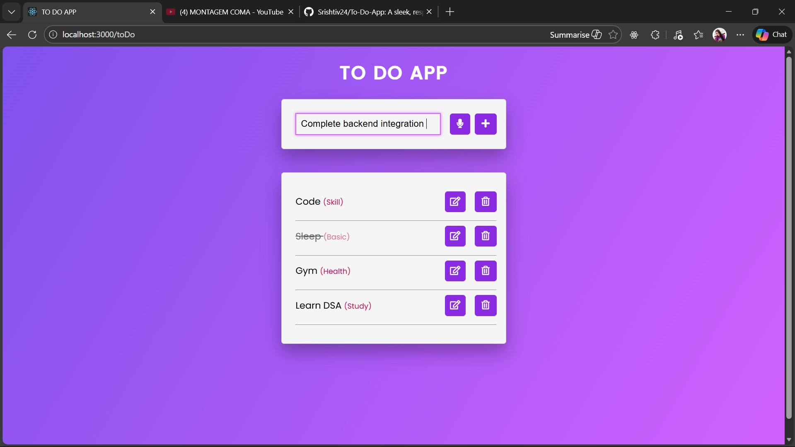

# To-Do App with AI Categorization

A modern, accessible to-do list application built with vanilla JavaScript and Node.js.  
Features include **voice input**, **local storage persistence**, **AI-powered categorization**, and a clean, recruiter-ready UI.

---

## ✨ Features
- 🎤 **Voice Input**: Add tasks hands-free using the browser’s SpeechRecognition API.
- 🧠 **AI Categorization**: Each task is automatically tagged (e.g., Work, Health, Skill) via an AI backend.
- 💾 **Local Storage Persistence**: Tasks remain saved across page reloads.
- 🗑️ **Edit & Delete**: Update or remove tasks with intuitive controls.
- ✅ **Mark Complete**: Toggle task completion with a simple click.
- 🎨 **Accessible UI**: Responsive design for all screen sizes.
  
---

## 🛠️ Tech Stack
- **Frontend**: HTML5, CSS3, Vanilla JavaScript  
- **Backend**: Node.js, Express  
- **AI Integration**: OpenRouter SDK (for task categorization)  
- **Storage**: LocalStorage (browser)  
- **Deployment**: Render (cloud hosting)

---

## 🌐 Live Demo
Deployed on Render:  
👉 [https://to-do-app-j1y8.onrender.com](https://to-do-app-j1y8.onrender.com)

